# Policy Contrastive Decoding for Robotic Foundation Models

Official implementation of the paper "[Policy Contrastive Decoding for Robotic Foundation Models](https://arxiv.org/abs/2505.13255)".

> Note: We are doing our best to improve this work. If you have any questions or suggestions, please feel free to create an issue in this repo or contact us at shihan.wu.koorye@outlook.com.

[[Project]](https://koorye.github.io/proj/PCD) [[ArXiv]](https://arxiv.org/abs/2505.13255) [[PDF]](https://arxiv.org/pdf/2505.13255) [[PCD-real]](https://github.com/Koorye/PCD-real)

## News
- 🔥**May 23, 2025**: Our paper has been updated for better clarity and readability. The optimized version is now available on [arXiv](https://arxiv.org/abs/2505.13255).
- 🔥**May 20, 2025**: The code is released and the paper is now available on [arXiv](https://arxiv.org/abs/2505.13255v1).

## Introduction

> **Abstract** Generalist robot policies, or robotic foundation models, hold immense potential to enable flexible, general-purpose and dexterous robotic systems. Despite their advancements, our empirical experiments reveal that existing robot policies are prone to learning spurious correlations from pre-training trajectories, adversely affecting their generalization capabilities during inference. To tackle this, we propose a novel **Policy Contrastive Decoding (PCD)** approach, which redirects the robot policy’s focus toward object-relevant visual clues by contrasting action probability distributions derived from original and object-masked visual inputs. As a training-free method, our PCD can be used as a *plugin* to improve different types of robot policies without needing to finetune or access model weights. We conduct extensive experiments on top of three open-source robot policies, including the autoregressive policy **OpenVLA** and the diffusion-based policies **Octo** and $\pi_0$. The obtained results in both simulation and real-world environments prove PCD’s flexibility and effectiveness, e.g., PCD enhances the state-of-the-art policy $\pi_0$ by **8%** in the simulation environment and by **108%** in the real-world environment.

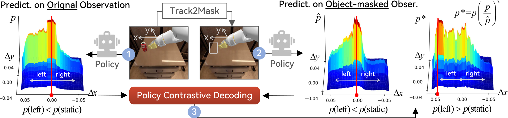

## Experiments

### Overall Performance

**Simulated Environments**

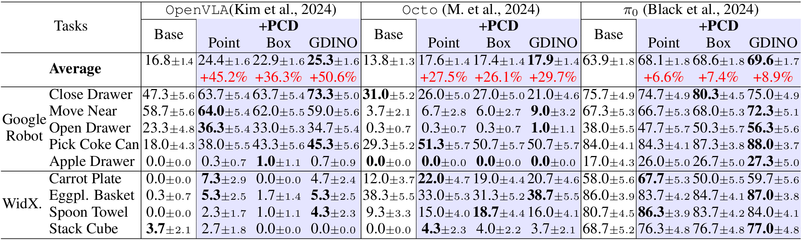

**Real-world Environments**

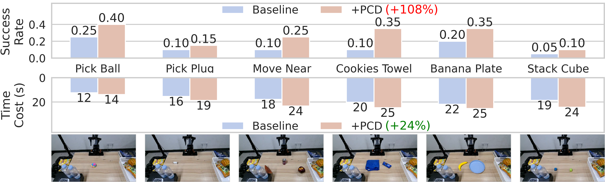

### Performance on Different Factors

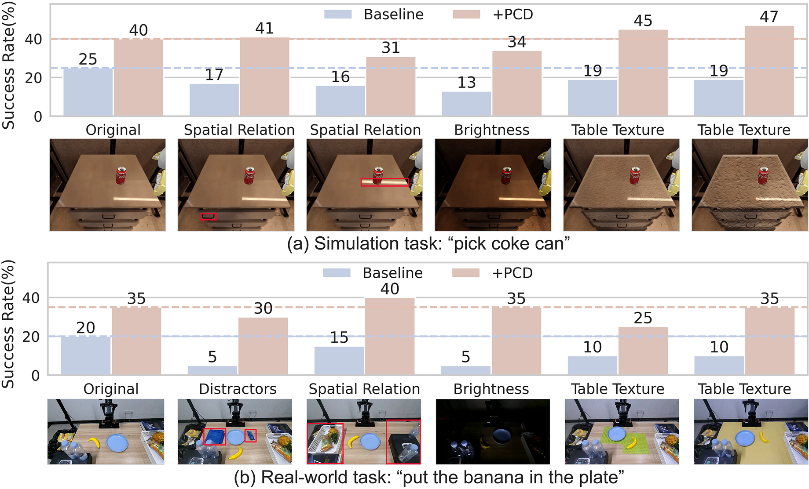

## Videos

### Real-world Environments

> **Note**: The relevant code of the real-world experiments is available in [PCD-real](https://github.com/Koorye/PCD-real).

| Baseline: Pick Ball                                             | Baseline: Move Near                                                             | Baseline: Banana Plate                                                         | Baseline: Stack Cube                                                       |
|:-------------------------------------------------------------------:|:---------------------------------------------------------------------:|:--------------------------------------------------------------------:|:----------------------------------------------------------------:|
|       |         |  |  |
| **+Ours: Pick Ball**                                                      | **+Ours: Move Near**                                                        | **+Ours: Banana Plate**                                                    | **+Ours: Stack Cube**                                                  |
|       |         |  |  |
| **Baseline: Distractors**                                                     | **Baseline: Spatial Relation**                                                  | **Baseline: Brightness**                                                       | **Baseline: Texture**                                                      |
|  |  |    |      |
| **+Ours: Distractors**                                                | **+Ours: Spatial Relation**                                             | **+Ours: Brightness**                                                  | **+Ours: Texture**                                                 |
|  |  |    |      |

### Simulated Environments

| Baseline: Pick Coke Can                                                             | Baseline: Move Near                                                             | Baseline: Carrot Plate                                                            | Baseline: Eggplant Basket                                                          |
|:-------------------------------------------------------------------------:|:---------------------------------------------------------------------:|:-----------------------------------------------------------------------:|:------------------------------------------------------------------------:|
| 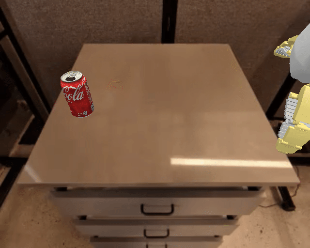 | 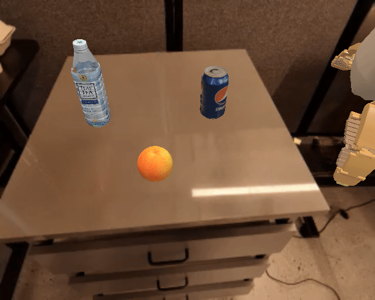     | 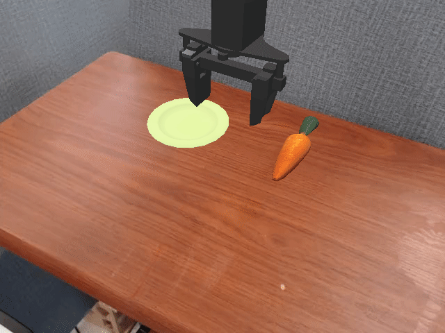 | 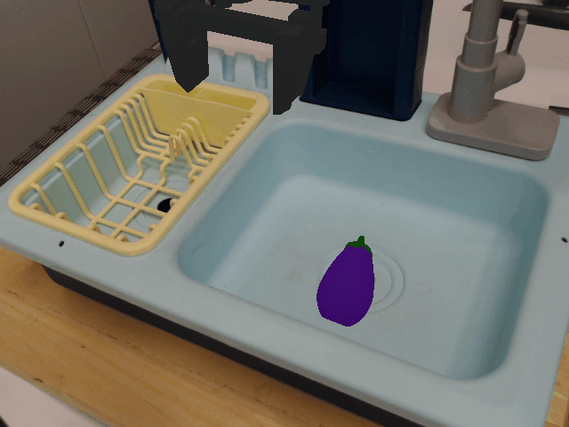 |
| **+Ours: Pick Coke Can**                                                            | **+Ours: Move Near**                                                            | **+Ours: Carrot Plate**                                                           | **+Our: Eggplant Basket**                                                         |
| 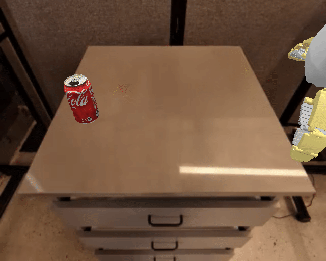 |      | 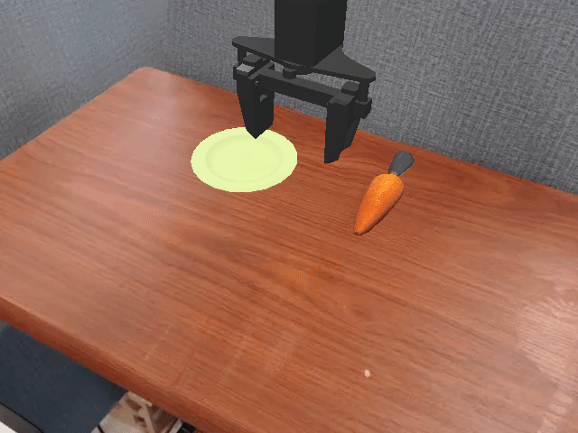 | 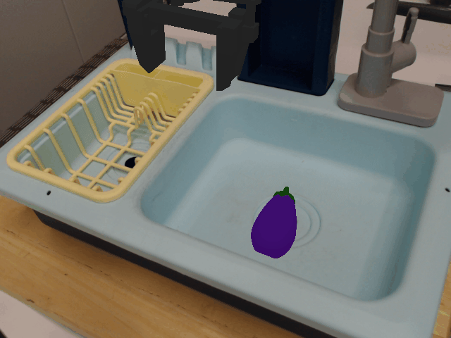 |
| **Baseline: Spatial Relation**                                                      | **Baseline: Brightness**                                                        | **Baseline: Texture**                                                             | **Baseline: Texture**                                                              |
| 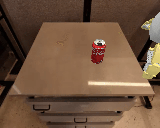  |  |          | 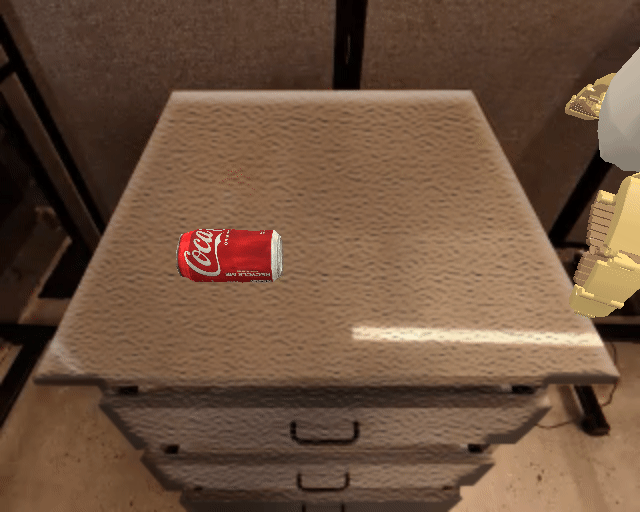     |
| **+Ours: Spatial Relation**                                                     | **+Ours: Brightness**                                                       | **+Ours: Texture**                                                            | **+Ours: Texture**                                                             |
| 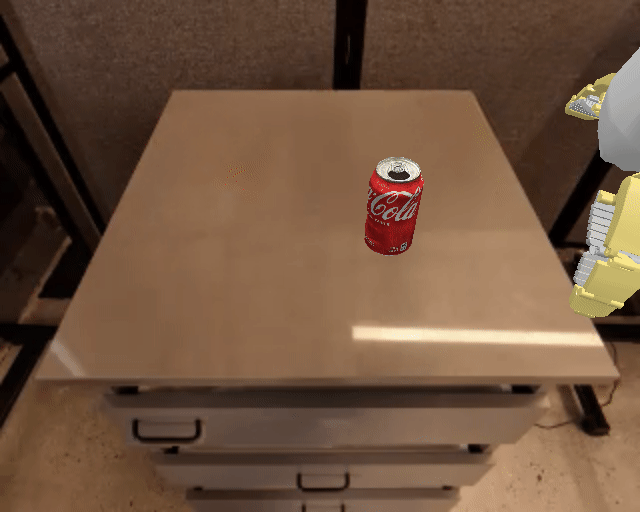  | 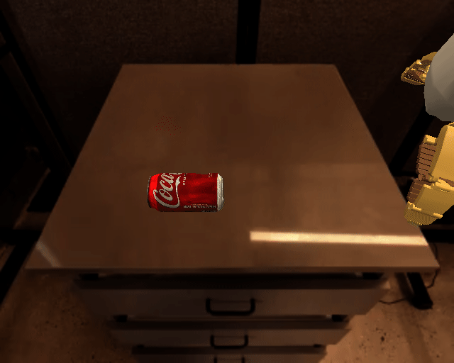 | 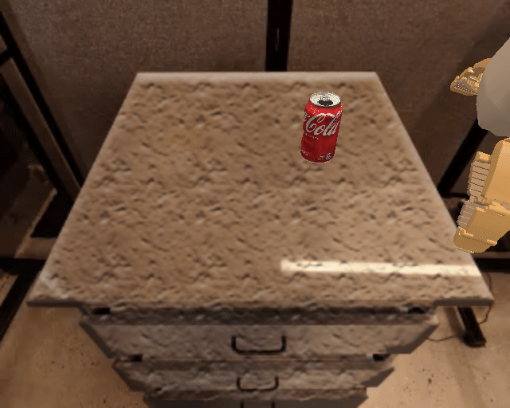         |      |

## Running

1. Clone this repository.

```bash
git clone https://github.com/Koorye/PCD.git
```

2. Install all dependencies.

```bash
conda create -n pcd python=3.10
conda activate pcd
bash scripts/install_dependencies.sh
```

3. Download model checkpoints.

> **Note**: Some of the checkpoints cannot be downloaded directly, you may need to download them manually from the links provided in the script.

```bash
bash scripts/download_pretrained_weights.sh
```

3. Run evaluation on simpler.

```bash
bash scripts/default/inference/run.sh
```

## Acknowledgements

Our work is built upon the following open-source projects: [SimplerEnv](https://github.com/simpler-env/SimplerEnv), [OpenVLA](https://github.com/openvla/openvla), [Octo](https://github.com/octo-models/octo), [Open Pi-0](https://github.com/allenzren/open-pi-zero), [Grounded SAM2](https://github.com/IDEA-Research/Grounded-SAM-2), [YOLO World](https://github.com/AILab-CVC/YOLO-World), [SED](https://github.com/xb534/SED), [Inpaint Anything](https://github.com/geekyutao/Inpaint-Anything).
We thank the authors for releasing their code. If you use our model and code, please consider citing these works as well.